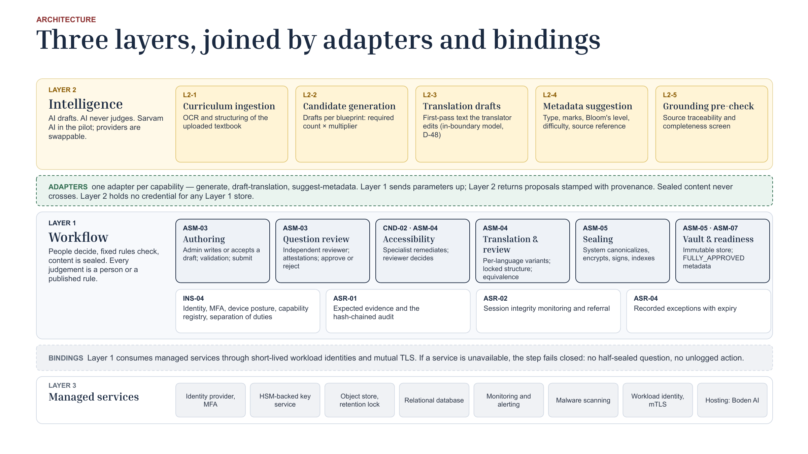

# Architecture — Rachana workflow core and product boundaries

This is the reference architecture for Project Rachana, maintained in this
repository. [Document control](source-of-truth.md) records the baseline and
accepted amendments. Requirements trace through [the requirement index](traceability.md).
Locations below are planned unless [delivery status](delivery-status.md)
establishes they exist.

## Architecture diagram



[Open the architecture diagram at full size](assets/rachana-three-layer-architecture.png).
The diagram is embedded in the repository and describes the design target.

## Product layers and workflow

| Layer | Responsibilities | Boundary |
|---|---|---|
| Layer 2 — Intelligence | Curriculum ingestion/OCR; candidate generation at required count × multiplier; translation drafts; metadata suggestions; grounding pre-check | Sarvam AI in the pilot, replaceable providers. Returns proposals with provenance; never approves content |
| Layer 1 — Workflow | Authoring, independent question review, accessibility remediation/review, language variants, system sealing, vault and readiness | Owns permissions, state, deterministic rules and evidence. Admin content work uses the signed client; configuration/content-free oversight uses the web app |
| Layer 3 — Managed services | Identity/MFA; HSM-backed keys; retention-locked object storage; relational database; monitoring/alerting; malware scanning; workload identity/mutual TLS; hosting | Bodhan AI is the planned host and continuing maintainer. Service bindings, identities, deployment and acceptance remain to be established |

Cross-cutting controls cover identity/capability and separation of duties
(INS-04), expected evidence and audit (ASR-01), session integrity and referral
(ASR-02), and recorded exceptions with expiry (ASR-04). Adjacent block labels
describe interfaces; they do not enlarge the five full blocks committed in
the [delivery plan](delivery-plan.md).

Layer 1 owns state, authorization, deterministic validation, evidence,
sealing and readiness. Layer 2 drafts curriculum-grounded candidates,
translation text and metadata (D-38); it receives no sealed content or
credentials for Layer 1 stores. The gateway is one integration seam, not
the full Layer 2 delivery. The sprint target is 28 September 2026, including
Layer 2 integration. Named delivery ownership and adoption semantics remain
R2/R4 in [reconciliation](prd-reconciliation.md); D-48 gates translation AI.

Capability adapters cover `generate`, `draft-translation` and
`suggest-metadata`: Layer 1 sends governed parameters; Layer 2 returns
proposals stamped with provenance. A grounding pre-check is advisory and
does not replace deterministic validation or human review.

Managed-service bindings use short-lived workload identities and mutual TLS
where applicable to service connections. A required dependency failure must
stop the protected step without a half-sealed artefact or unlogged action.
This rule concerns workflow/integrity dependencies; optional diagnostic
telemetry retains its separate loss policy in R9.

The [product workflow](product-workflow.md) gives the role/operation matrix,
reviewer isolation, rejection handling and full transition guards. The Admin
authors in V1 and never approves a review. Accessibility Specialist completion
and Accessibility Reviewer approval are distinct gates. The pending separate
Author-role clarification is recorded in R4. The diagram groups components;
the state machine below specifies their execution order, including sealing
the primary before creating language variants.

## State machine (server-authoritative; main §13, annex §5)

```
DRAFT → IN_QUESTION_REVIEW → IN_ACCESSIBILITY → IN_ACCESSIBILITY_REVIEW
→ SEALING_REQUESTED → SEALED (primary)
→ IN_TRANSLATION → IN_TRANSLATION_REVIEW (each required language)
→ IN_ACCESSIBILITY → IN_ACCESSIBILITY_REVIEW → SEALING_REQUESTED → SEALED
All required language seals on current lineage → FULLY_APPROVED readiness
```

- A return creates a new linked draft carrying findings; the returned version
  stays immutable. Corrected work goes to a different reviewer; affected
  gates repeat under the cycle's remediation policy.
- Sealing is a system action; no human seal control exists.
- Primary + all required languages sealed on one lineage ⇒ ready.
- Correction creates a new lineage and revokes readiness; variants are marked
  for revalidation.
- Downstream: Used → Archived, driven by signed notifications (QST06-LFC).
- WITHDRAWN and RETIRED replace physical deletion. FULLY_APPROVED is
  computed artefact readiness, not a language-version state.

## Repository map

| Spec group | Repo location |
|---|---|
| Content task surfaces | `apps/client` (Tauri); includes Admin authoring and unsealed-content work (R1 decided) |
| Configuration and oversight surfaces | `apps/web` (Next.js); includes Admin configuration and content-free oversight (R1 decided) |
| Application (domain services) | `platform/core` (FastAPI) |
| Workers (protected jobs) | `platform/core` workers + `providers/*` |
| Data (PostgreSQL, audit store, object store) | `db/`, `providers/storage-*`, `providers/kms-*` |
| Provider interfaces | `platform/spi` (`mulyankan-spi`) |
| Provider implementations | `providers/` |
| Vendored design system (static tarball) | `design-system/` |

No entry authorises direct database access from a client, including Next.js
server components. The versioned client/server contract is planned under
`contracts/`. Layer 2's deployment/repository is unassigned. Rendering topology
and per-OS equivalence need the R5 decision before the render contract is fixed.

## Invariants (violating any of these is a design bug)

1. The server-side state machine is authoritative; client claims are never
   trusted (ARC-01).
2. A state change and its audit event commit in one database transaction
   (ARC-02).
3. Audit events are append-only, hash-chained, and content-free
   (ASR01-EVD-01/02/09).
4. Returns create linked drafts; submitted, returned, and sealed versions are
   immutable (SEC-08).
5. No human seal control exists; the sealing worker is the only writer of
   sealed artefacts and manifests (ARC-05, QST05-VLT-01).
6. Sealed plaintext is unreadable through routine role surfaces or APIs,
   including administrator surfaces (SEC-01). The separately governed
   translation reference, correction seeding and emergency contracts are
   unresolved in R8; do not implement a human vault-read path from that prose.
7. No AI inside Layer 1; model outputs are untrusted proposals and must pass
   deterministic validation and human submission/review. The exact adoption
   transition is pending R4 (ARC-12 as amended by D-38, PRD-ARC-13).
8. Validation is deterministic: no probabilistic or external services in any
   validation path (QST03-VAL-03).
9. Domain and audit events leave via the transactional outbox, at-least-once,
   deduplicated by event id (ARC-03).
10. Canonicalization is bit-stable and versioned (DAT-05/06).

## Trust boundaries

- Browser → core-api: OIDC bearer token, TLS only, no content in URLs
  (DAT-03, INT-02).
- core-api → providers: in-process behind the registry; every interaction
  audited content-free.
- Workers → data: workload identity, least privilege (ARC-05, ARC-08).
- Downstream assembly → readiness API: mutual TLS with an audience-restricted
  workload token (ARC-06); metadata only, never content.
- Signed content client → core-api: narrow task protocol, user and machine
  identity, no local content persistence or server-delivered executable UI
  (ADR-0008/0010). Contract and enrolment are planned, not shipped guarantees.
- Layer 1 → Layer 2: outbound governed requests and untrusted responses;
  no model calls from validation, review, accessibility judgement, sealing,
  readiness or monitoring. D-48 must be approved before translation drafting.
- Diagnostic observability → Collector is separate from durable integrity
  ingest and audit. Optional diagnostic loss never waives expected evidence
  or ASR02-OBS-05 (see R9).

## Non-functional targets (annex §11; inherited from v4 §9)

50 concurrent sessions · 100k artefacts · 500k versions · read ≤ 2s ·
draft save ≤ 1.5s · operator signal ≤ 3s · durable audit ≤ 5s ·
99.5% availability · RTO 4h / RPO 15min · WCAG 2.1 AA · Unicode end-to-end.

These are targets, not measurements. Annex §11 also specifies seal timing
(95% of valid image-bearing artefacts within 30s) and integrity ingest load
(50 sessions at 2 events/s sustained, burst headroom to 10 per session).
The full performance, availability-window and acceptance definitions remain
in the annex and must be tied to retained results before closure.
