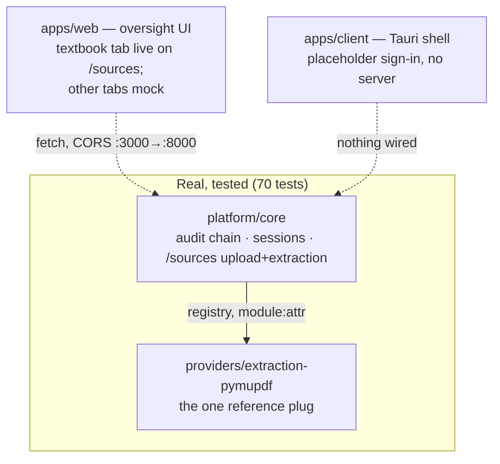
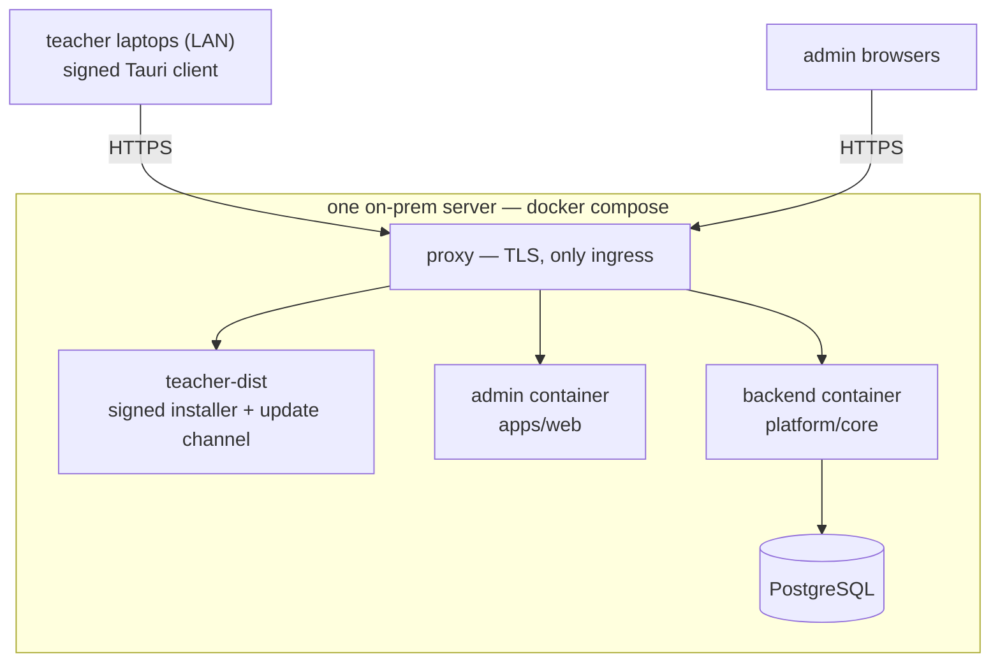

# As-built — what exists today

The rest of `docs/` describes the system through M6 in the present tense;
the root `AGENTS.md` lists the gap. **This page is the reader's anchor for
what is actually built.** It is updated in the same PR that changes the
answer. Tree state at the time of writing: the extraction slice recovered
(#93), phase-1 clarity items (this page, `canonicalization.md`, Makefile).

## As-is (what runs today)

*Solid arrows: real, exercised paths. Dashed: boundaries that exist on
paper only.*

**Real today:** the audit chain (append-only, hash-chained, content-free —
see `canonicalization.md`), session monitoring (ASR02-OBS-01), the
`/sources` upload + deterministic extraction pipeline, the provider
registry with typed SPI checks, and the conformance-suite pattern.

**Not built yet:** database (everything in-memory — restart forgets),
authentication (the API surface is unauthenticated; see `SECURITY.md`),
the authoring state machine, sealing, the gateway SPI, pagination,
the outbox.

## Target (ADR-0012's topology)

*One folder = one container = one thing to hold in your head. UIs are dumb
windows; every rule and every audit write lives in the backend, the only
container with database credentials and chain access.*

## The gap, as a table

| Capability | Docs say | Tree has |
|---|---|---|
| Audit chain | Invariant 3, ARC-02, DAT-05 | ✅ in-memory; DB store owed in M1 |
| Sessions + integrity view | ASR02-OBS-01 | ✅ in-memory, unauthenticated |
| Source upload + extraction | ADR-0009, DAT-01/03 | ✅ works; not audited (needs the DB transaction) |
| Provider registry + SPIs | ADR-0003 | ✅ `kms` interface + `extraction` SPI/provider |
| Database | `db/`, ARC-02 | ❌ absent |
| Identity | ADR-0004 | ❌ absent — nothing authenticates |
| State machine | `architecture.md` | ❌ absent |
| Sealing | Invariants 4–6, QST05 | ❌ absent (no KMS provider either) |
| Gateway (AI proposals) | ADR-0007, invariant 7 | ❌ absent |
| Deployment | ADR-0012 | ❌ `Dockerfile` is a placeholder |
| Contracts | ADR-0008 | ❌ OpenAPI is the stand-in until authored |

## Known limitations (honest list)

- **Nothing authenticates.** Any network peer that can reach the API can
  register sessions, forge signals onto the chain, or upload documents.
  Development-only until the identity slice lands (`SECURITY.md`).
- **In-memory stores.** A restart forgets sessions and sources; the audit
  chain with them. The stores' semantics are the specification the database
  store must reproduce byte-identically.
- **Ingestion writes no audit events — deliberately.** Invariant 2 requires
  a state change and its audit event in one transaction; with no database
  there is no transaction, and a chain written without one cannot be
  trusted. Owed with `db/`, not forgotten.
- **Single process.** The stores are per-process; a second worker would
  have its own index. The database milestone removes this.
- **The Tauri client serves no role yet** — its sign-in is a placeholder
  and nothing is wired (`apps/client/AGENTS.md` has the honest inventory).
